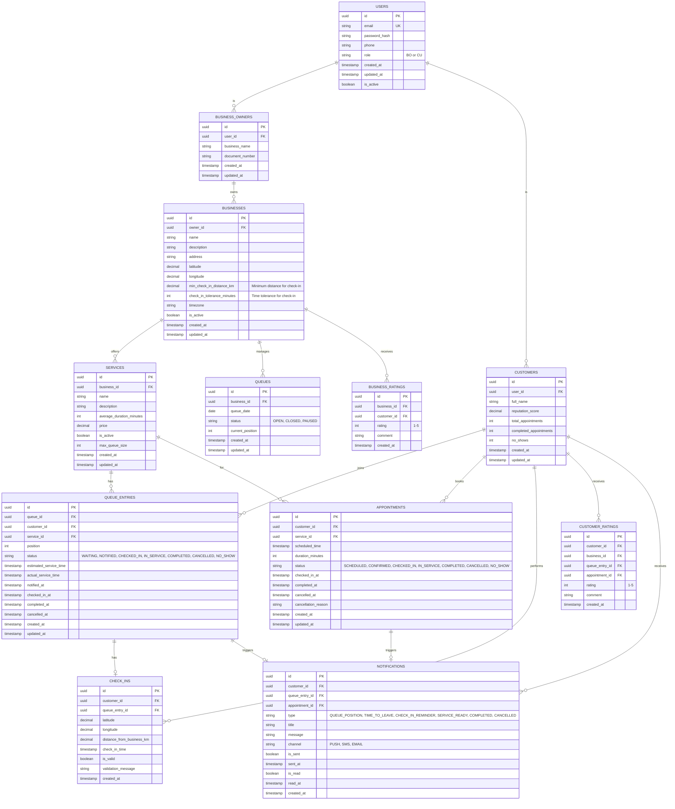

# EasyQueue Database Schema

This document contains the Entity-Relationship Diagram (ERD) for the EasyQueue system.

## Database Diagram



## Entity Descriptions

### Core Entities

- **USERS**: Base authentication and user management table for both Business Owners and Customers
- **BUSINESS_OWNERS**: Business owner profile extending the Users table
- **CUSTOMERS**: Customer profile with reputation tracking
- **BUSINESSES**: Physical business locations with geolocation data
- **SERVICES**: Services offered by businesses with duration and pricing

### Queue Management

- **QUEUES**: Daily queue instances for each business
- **QUEUE_ENTRIES**: Individual customer positions in queues with status tracking
- **APPOINTMENTS**: Pre-scheduled appointments as an alternative to walk-in queues

### Location & Validation

- **CHECK_INS**: Geolocation-based attendance validation with distance verification

### Communication

- **NOTIFICATIONS**: Multi-channel notification system for queue updates and reminders

### Reputation System

- **CUSTOMER_RATINGS**: Business ratings of customer reliability
- **BUSINESS_RATINGS**: Customer ratings of business service quality

## Key Features Supported

1. **Geolocation Check-in**: `CHECK_INS` table validates customer location against business coordinates
2. **Distance & Tolerance Rules**: `BUSINESSES` table stores configurable `min_check_in_distance_km` and `check_in_tolerance_minutes`
3. **Real-time Queue Tracking**: `QUEUE_ENTRIES` with position and status management
4. **Smart Notifications**: `NOTIFICATIONS` table supports multiple channels and types
5. **Reputation System**: Both `CUSTOMER_RATINGS` and `BUSINESS_RATINGS` for accountability
6. **Hybrid Scheduling**: Supports both walk-in queues and pre-scheduled appointments

## Indexes Recommendations

```sql
-- User lookups
CREATE INDEX idx_users_email ON USERS(email);
CREATE INDEX idx_users_role ON USERS(role);

-- Business queries
CREATE INDEX idx_businesses_owner_id ON BUSINESSES(owner_id);
CREATE INDEX idx_businesses_location ON BUSINESSES(latitude, longitude);
CREATE INDEX idx_businesses_is_active ON BUSINESSES(is_active);

-- Service queries
CREATE INDEX idx_services_business_id ON SERVICES(business_id);
CREATE INDEX idx_services_is_active ON SERVICES(is_active);

-- Queue management
CREATE INDEX idx_queues_business_date ON QUEUES(business_id, queue_date);
CREATE INDEX idx_queue_entries_queue_id ON QUEUE_ENTRIES(queue_id);
CREATE INDEX idx_queue_entries_customer_id ON QUEUE_ENTRIES(customer_id);
CREATE INDEX idx_queue_entries_status ON QUEUE_ENTRIES(status);
CREATE INDEX idx_queue_entries_position ON QUEUE_ENTRIES(queue_id, position);

-- Appointments
CREATE INDEX idx_appointments_customer_id ON APPOINTMENTS(customer_id);
CREATE INDEX idx_appointments_service_id ON APPOINTMENTS(service_id);
CREATE INDEX idx_appointments_scheduled_time ON APPOINTMENTS(scheduled_time);
CREATE INDEX idx_appointments_status ON APPOINTMENTS(status);

-- Check-ins
CREATE INDEX idx_check_ins_customer_id ON CHECK_INS(customer_id);
CREATE INDEX idx_check_ins_queue_entry_id ON CHECK_INS(queue_entry_id);

-- Notifications
CREATE INDEX idx_notifications_customer_id ON NOTIFICATIONS(customer_id);
CREATE INDEX idx_notifications_is_sent ON NOTIFICATIONS(is_sent);
CREATE INDEX idx_notifications_created_at ON NOTIFICATIONS(created_at);

-- Ratings
CREATE INDEX idx_customer_ratings_customer_id ON CUSTOMER_RATINGS(customer_id);
CREATE INDEX idx_customer_ratings_business_id ON CUSTOMER_RATINGS(business_id);
CREATE INDEX idx_business_ratings_business_id ON BUSINESS_RATINGS(business_id);
```
